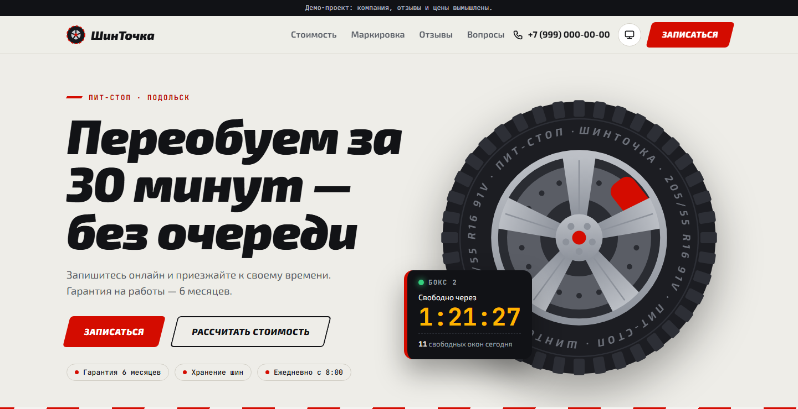

# ШинТочка — лендинг шиномонтажа с заявками в Telegram

Демо-лендинг для шиномонтажа в стиле «пит-стоп»: калькулятор переобувки, расшифровка маркировки шины, выбор окна записи. Заявки приходят в Telegram, а если Telegram недоступен — на почту.
Компания, цены и отзывы вымышлены.

**Демо:** https://znikdk.github.io/landing-demo/

| Телефон | Компьютер |
|---|---|
|  |  |

## Что умеет

**Интерактив**
- Колесо на первом экране нарисовано кодом (SVG) и крутится при прокрутке; рядом табло «Свободно через» с обратным отсчётом до ближайшего окна.
- Калькулятор переобувки: тип машины, диаметр R13–R22, балансировка, хранение, мойка. Цена и время пересчитываются сразу, колесо меняет размер, а кнопка переносит расчёт в заявку.
- Расшифровка маркировки «205/55 R16 91V»: нажимаете на часть надписи на боковине — на разрезе шины подсвечивается размер и появляется объяснение.
- Выбор окна записи в форме: дни и время, занятые окна неактивны, выбор подставляется в поле «Удобное время».
- Прайс в виде табло, стопка шин в акции, машинка едет по трассе к финишу, схема проезда с бегущим маршрутом.
- Светлая и тёмная тема (и режим «как в системе»), анимации отключаются при настройке «уменьшить движение».

**Основа**
- Вёрстка под телефон в первую очередь, без фреймворков и JS-библиотек.
- SEO: title и description, Open Graph, микроразметка schema.org `AutoRepair`, sitemap, robots.
- Форма: маска телефона, проверка полей в браузере и на сервере, защита от спама (скрытое поле и проверка времени заполнения).
- Заявки в Telegram, при сбое — на почту. Токен бота хранится на сервере и в браузер не попадает.
- Работает и без JavaScript: форма отправляется обычным POST.
- Шаблон: тексты, услуги, цены калькулятора, маркировка, цвета обеих тем и порядок блоков — в одном файле `site/_data/site.json`.

## Стек

- Сайт: Eleventy 3, Nunjucks, HTML, CSS, чистый JavaScript. Хостинг — GitHub Pages, сборка через GitHub Actions.
- Приём заявок: Yandex Cloud Functions (Node.js 22), Telegram Bot API, SMTP (nodemailer).
- Тесты: встроенный `node:test`.

## Как это работает

```
Браузер ──▶ GitHub Pages (статичный сайт)
   └── POST заявки ──▶ Yandex Cloud Function ──▶ Telegram
                                     └── при сбое ──▶ почта
```

## Быстрый старт

```bash
npm ci
npm test
npm start            # сайт на http://localhost:8090
```

Проверка формы локально без отправки в Telegram:

```bash
cp function/.env.example function/.env   # указать DRY_RUN=1, ALLOWED_ORIGIN=http://localhost:8090, SITE_URL=http://localhost:8090/
npm run dev:function                     # функция на http://localhost:8787
```
и запустить сайт с `FORM_ENDPOINT=http://localhost:8787`.

## Как перенастроить под другой бизнес

1. Отредактировать `site/_data/site.json`: название, тексты, услуги, цены, контакты, цвета (`theme`), порядок блоков (`sections`).
2. Заменить фото в `site/assets/img/` (`hero-800.webp`, `hero-1600.webp`, `og.jpg`).
3. Выполнить `npm run sync:services`, чтобы функция знала новый список услуг.
4. Поменять в функции `SITE_NAME`, `SITE_URL`, `ALLOWED_ORIGIN` и данные бота и почты.
5. `npm test` — тесты проверят, что все блоки на месте и списки услуг совпадают.

## Развёртывание

### Сайт
Settings → Pages → Source: GitHub Actions. Каждый push в `main` запускает тесты и публикует сайт.

### Telegram-бот
1. В @BotFather создать бота (`/newbot`) и сохранить токен.
2. Написать боту любое сообщение, открыть `https://api.telegram.org/bot<ТОКЕН>/getUpdates` и взять `chat.id`.

### Почта (запасной канал)
В Яндекс ID → Безопасность → Пароли приложений создать пароль для почты.

### Функция в Yandex Cloud
1. Cloud Functions → Создать функцию → сделать её публичной.
2. Создать версию: среда `nodejs22`, точка входа `index.handler`, тайм-аут 20 с, память 128 МБ.
3. Загрузить ZIP-архив из содержимого папки `function/` (без `node_modules` и `.env`). Архив собирается встроенным в Windows 10 `tar`: `Compress-Archive` из Windows PowerShell 5.1 пишет пути с обратным слешем, и в облаке функция не найдёт `core/`.
   ```powershell
   cd function
   tar.exe -a -c -f ..\function.zip index.js core package.json package-lock.json
   cd ..
   ```
4. Вписать переменные окружения по списку из `function/.env.example`.
5. Адрес функции (`https://functions.yandexcloud.net/<id>`) записать в `form.endpoint` в `site.json`.

## Персональные данные (152-ФЗ)

В форме есть согласие на обработку и страница политики. Функция не пишет имена и телефоны в логи.
Telegram хранит данные за рубежом: заказчику, который принимает заявки в Telegram, нужно уведомить Роскомнадзор о трансграничной передаче. Если это неприемлемо, можно оставить только почту на российском сервисе.

## Структура

```
site/            страница: шаблоны, стили, скрипты, контент (site.json)
function/        облачная функция: index.js — вход, core/ — логика
tests/           тесты
scripts/         синхронизация списка услуг
lib/             вспомогательные функции сборки
```

## Иллюстрации и фото

Колесо, шины, трасса и схема проезда нарисованы кодом (SVG/CSS). Шрифты — Exo 2 и JetBrains Mono (Google Fonts, SIL Open Font License).

Фото для превью в соцсетях: [Lex](https://unsplash.com/@lex_living) на [Unsplash](https://unsplash.com/photos/mechanic-using-impact-wrench-on-car-wheel-u49lt6K02e0), Unsplash License.
